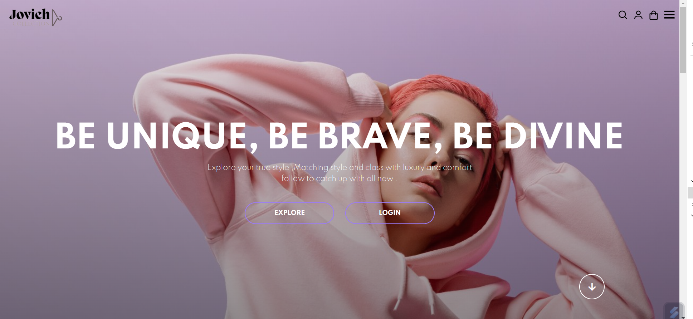

# jovich
clothes shop
J'ai conçu un site Web de commerce électronique dynamique en utilisant HTML, CSS et JavaScript. 
Ce site propose une large sélection de marques de vêtements à la mode, offrant ainsi aux clients une expérience d'achat en ligne fluide et stimulante.
Le design et la fonctionnalité du site visent à augmenter les ventes en ligne en offrant aux utilisateurs une plateforme conviviale pour explorer, choisir et acheter des vêtements tendance de différentes marques.

[English]

I have developed a dynamic e-commerce website using HTML, CSS, and JavaScript. This website showcases a diverse range of fashionable clothing brands, providing customers with a seamless online shopping experience. 
The site's design and functionality are geared towards boosting online sales by offering users a user-friendly platform to browse, select, and purchase trendy clothing from various brands.

